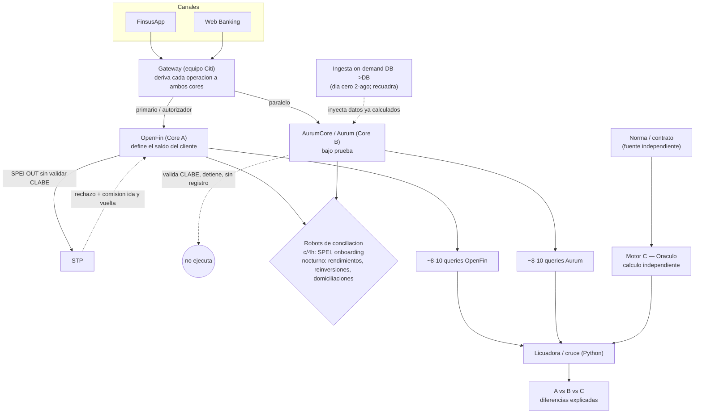

# Artefacto — Arquitectura del Paralelo OpenFin ↔ AurumCore

Versión: 2 · Actualizado: 2026-08-14 · Fuente principal: F-001 (sesión kickoff); refinado con F-009/F-010
Sustento: [[K-ARQ-001]] [[K-ARQ-002]] [[K-TMP-001]] [[K-MOV-001]] [[K-MOV-002]] [[K-MOV-003]] [[K-MIG-002]] [[K-PRC-001]]

> Todo lo del diagrama es `[CONFIRMADO]` por F-001 salvo lo marcado. Confianza media donde proviene
> sólo de narración (los screenshots no capturaron el dibujo de arquitectura de la sesión).

## Flujo de operaciones

## Cronología de corte (K-ARQ-002)
| fecha | evento |
|-------|--------|
| 2026-08-02 | "Día cero": ingesta para nacer cuadrados |
| 2026-09-01 | Decisión go/no-go |
| 2026-09-07 | Deadline para demostrar operación |
| 2026-10-01 | (si procede) switch: **Aurum pasa a primario**; OpenFin queda para switchback |

## Matriz de diferencias de diseño OpenFin vs Aurum
| tema | OpenFin (Core A) | Aurum (Core B) | pieza | efecto en la comparación |
|------|------------------|----------------|-------|--------------------------|
| Atomicidad | cargo + abono; reversa si falla → 2-3 registros | operación atómica → 1 registro | [[K-MOV-001]] | conteos difieren; normalizar a la unidad atómica |
| CLABE en SPEI OUT | no valida; deja salir, STP regresa, doble comisión | valida (dígito verif.); detiene, sin registro | [[K-MOV-002]] | Aurum sin registro ≠ "falta operación"; candidato DEFECTO_OPENFIN |
| Redondeo | 2 decimales | trunc 20 dec intermedio; ISR diario trunc 5; final a 2 (vista normal / plazo half_even; "ceil a 10" en plazo) | [[K-DEV-001]] v2 | diferencias ≤$0.10; el ceil del plazo sesga positivo → prueba de signo |
| ISR (regla) | mal calculado "toda la vida" (histórico) | regla documentada: 5·UMA exento, tasa/365, prorrateo por cuenta | [[K-FIS-001]] [[K-FIS-002]] | candidato DEFECTO_OPENFIN; oráculo calcula desde norma (S-FIS-001); verificar params (P-010) |
| Rendimientos plazo | ~18:30 | en la noche | [[K-TMP-001]] | descuadre de saldo intradía por sincronía |
| ID de reinversión | ID propio del core | ID propio del core | [[K-MOV-003]] | sin llave 1:1; usar llave sustituta |

## Lo que este artefacto NO afirma
- Las **cifras** del día cero (narradas en F-001) — no verificadas (P-009).
- El **linaje de datos** interno de cada core (tablas/campos) — [PENDIENTE] (P-004).
- El diagrama de arquitectura mostrado en la sesión — no se capturó en screenshot.

## Mantenimiento
Regenerar cuando cambien K-ARQ-002, K-TMP-001 o el modelo de corte. Si una pieza sube de versión,
revisar este artefacto (dependencia declarada arriba).
