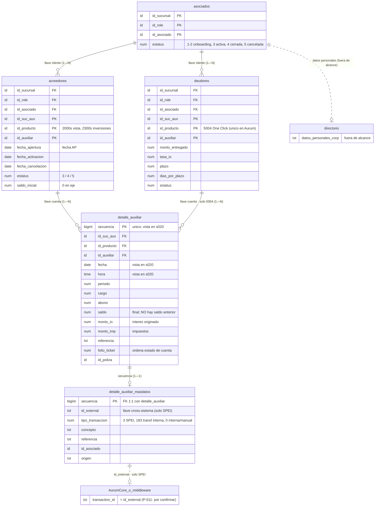

# Modelo de datos de OpenFin — diagrama ER

Fuente: **F-011** (+ pantallas s009/s020). Notación entidad-relación (crow's foot).
Nombres **conceptuales** salvo `secuencia`, `fecha`, `hora` (vistos en s020); los físicos exactos y
los tipos llegan con el `describe` (P-004). El modelo de AurumCore es P-011.

## Cómo leer la cardinalidad
- `||--o{` = **uno a cero-o-muchos** (un cliente tiene N cuentas; una cuenta tiene N movimientos).
- `||--o|` = **uno a cero-o-uno** (cada movimiento tiene a lo más una fila de extensión, por `secuencia`).
- `||..o|` (línea punteada) = relación **no identificante / cross-sistema** (no es una FK dura):
  `id_external` amarra el movimiento con middleware/AurumCore, pero sólo está garantizado en SPEI.

## Notas
- Llave **cliente** = (`id_sucursal`, `id_role`, `id_asociado`); llave **cuenta** =
  (`id_suc_aux`, `id_producto`, `id_auxiliar`); `id_suc_aux` ≠ `id_sucursal`.
- `detalle_auxiliar` guarda **cargo/abono/saldo final** (sin saldo anterior ni saldo promedio → se
  reconstruyen, [[K-MOV-006]]).
- OpenFin registra **movimientos, no transacciones**; el `tipo_transaccion` vive en `_masdatos` ([[K-MOV-005]]).
- Detalle completo y apartados en [MODELO_DATOS_OPENFIN.md](MODELO_DATOS_OPENFIN.md). Sustento: [[K-DAT-002]] [[K-DAT-003]] [[K-DAT-004]] [[K-DAT-005]].
