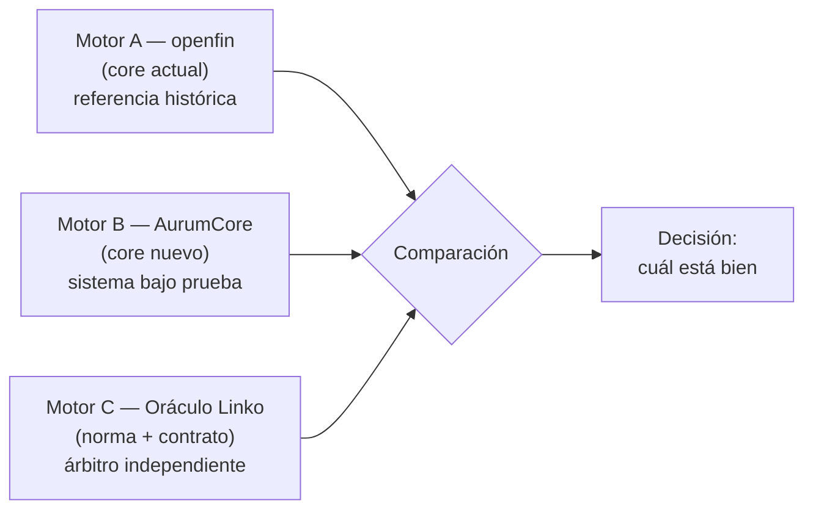
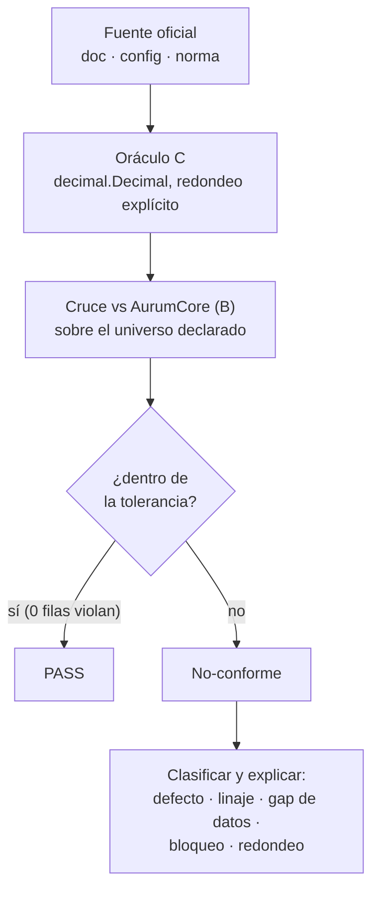
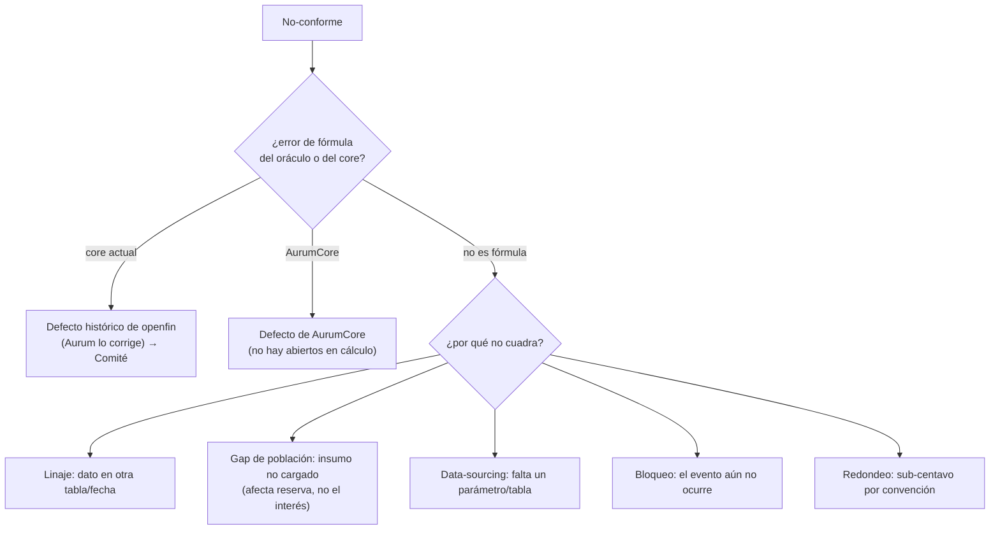

# Manual de Definiciones — Validación del Oráculo (motor C) · AurumCore

**Linko · Tercero independiente** · Validación de migración de core Finsus (openfin → AurumCore)
Versión 1.0 · 2026-08-24 · Para: Auditoría Interna de Finsus

---

## 1. Propósito y alcance

Este manual define, de forma autoritativa, **los conceptos, criterios, universos y fórmulas** que sustentan la
validación independiente de los motores de cálculo de AurumCore. Es la referencia para que Auditoría entienda
**qué se valida, cómo, contra qué fuente, y qué significa cada resultado**.

**Alcance:** motores de cálculo (captación, crédito, fiscal, regulatorio IFRS 9), completitud transaccional,
contabilidad de doble partida e identidad. **Fuera de alcance de este manual:** el dictamen técnico (lo emite el
humano el 7-sep) y el detalle operativo de ejecución del oráculo (ver *Manual de Uso del Oráculo — Auditor*).

---

## 2. Marco conceptual — el modelo de tres motores

La validación se apoya en tres motores independientes. El **motor C (oráculo)** implementa las reglas **desde la
norma y el contrato**, no desde el código de ningún core, lo que le permite **arbitrar** cuál de los dos cores está
bien cuando difieren.

**Definiciones de los motores:**

| Motor | Definición | Rol |
|---|---|---|
| **A** | openfin, el core actual | Referencia histórica. **No es la verdad.** |
| **B** | AurumCore, el core nuevo | El sistema **bajo prueba**. |
| **C** | El oráculo de Linko, en `decimal.Decimal` (aritmética exacta, **cero `float`**), redondeo explícito | El **árbitro** independiente. |

**Matriz de decisión** (= significa "coinciden", ≠ "difieren"):

| A | B | C | Interpretación |
|---|---|---|---|
| = | = | = | OK |
| = | = | ≠ | Defecto histórico de negocio: **ambos cores mal**. Severidad máxima. |
| = | ≠ | = | Defecto de AurumCore. |
| ≠ | = | = | Defecto de openfin ya corregido en AurumCore. |
| ≠ | ≠ | ≠ | La **regla** está mal especificada (no es problema de código). |

---

## 3. Flujo de validación

Cada motor se valida con el mismo flujo: se implementa la regla en el oráculo desde su **fuente**, se cruza contra
AurumCore sobre un **universo** declarado, y el resultado es **PASS** o un **no-conforme clasificado y explicado**.

**Regla de oro (invariante):** cada prueba está escrita para **devolver las filas que VIOLAN la regla**. **0 filas =
PASS.** Nunca se compara un total "a ojo"; se buscan activamente los que fallan. **Verde ≠ auto-aprobado.**

---

## 4. Glosario de definiciones

- **Oráculo (motor C).** El cálculo independiente de Linko, derivado de la norma y el contrato.
- **Universo / población / cohorte.** El conjunto de casos probados, siempre declarado con su tamaño (p.ej. *530,195
  periodos*). Un resultado sin universo no es interpretable.
- **Invariante.** Una identidad que debe cumplirse siempre (p.ej. "la balanza cuadra a 0.00"). La prueba devuelve
  las filas que la violan.
- **Tolerancia.** El margen permitido para declarar PASS. Depende del tipo de cálculo (ver §5).
- **PASS.** El caso cuadra dentro de la tolerancia.
- **No-conforme.** El caso queda fuera de la tolerancia; se **clasifica y explica** (§7). No implica automáticamente
  un defecto de AurumCore.
- **Exactitud a 1e-8.** Cuadrar en **8 decimales** = cuadrar el valor **sin redondear**. Es el criterio más estricto.
- **"Al centavo" (≤ $0.01).** Cuadrar en 2 decimales.
- **Sesgo.** Tendencia sistemática de las diferencias hacia un lado. Aunque cada diferencia sea de $0.01, si todas
  empujan igual, sobre el padrón **suman dinero** → defecto. En devengo se exige ≤$0.01 **y ausencia de sesgo**.
- **Redondeo half-up.** 2 decimales, "half away from zero" (0.005 → 0.01). Confirmado por Finsus: homogéneo en todo
  el core, aplicado **por evento** (cada devengo se redondea antes de acumular).
- **Base de días.** Convención de días del año para el devengo: **360** (Comercial) o **365/366** (Natural);
  parámetro por producto.
- **Fuente de una regla.** El respaldo de cada fórmula/parámetro:
  - **doc** — consta en un documento oficial de AurumCore (con página).
  - **config** — consta en una **tabla de configuración de la propia base de datos** de Aurum → la validación más
    fuerte (C = lo que el sistema tiene cargado).
  - **norma** — sustento legal (LISR, CNBV, Banxico).
  - **inferencia** — deducido de los datos; se marca como tal y se pide confirmación.

---

## 5. Criterios de validación (tolerancias y PASS)

| Tipo de prueba | Definición | Tolerancia PASS |
|---|---|---|
| **Identidad contable** | doble partida, amarre auxiliar↔balanza | **0.00 exacto** (sin excepción) |
| **Cálculo con redondeo** | interés/devengo | **≤ $0.01 por evento** *y* **ausencia de sesgo** |
| **Precisión completa** | cruce del valor sin redondear | **1e-8** (8 decimales) |
| **Completitud** | ¿falta alguna transacción? | **A ≥ B** (que no falte nada) |
| **Config** | C = la tabla de configuración de Aurum | **coincidencia exacta** fila por fila |

---

## 6. Catálogo de motores y validaciones

Formato: **definición · universo · fórmula · fuente · criterio de PASS · resultado.**

### 6.1 Captación / Inversión
| Motor | Universo | Fórmula | Fuente | PASS / Resultado |
|---|---|---|---|---|
| **Rendimiento plazo fijo** | 530,195 periodos (157,999 cuentas) | `RoundHalfEven2( Ceil10( Ceil10((Cap×Tasa)/100)/DíasAño )×Días )` | doc | **PASS 100%** (0 violaciones) |
| **Rendimiento vista** | posteos reales del 31-jul | `interés = SPM × dt × tasa / 36000` (base 360, half-up) | doc + Finsus | **◐ 82%** reconstruido de BD (ver §8) |
| **Saldo promedio (SPM)** | `finsus_account_history` | `SPM = (Σ saldo×días)/días devengados` | doc + Finsus | insumo en BD; SPM-rendimiento exacto en póliza |
| **GAT inversión** | 689,479 inversiones | `GAT = ((Inicial+Interés)/Inicial)^(360/días) − 1` | doc + datos | **PASS** (reproduce `nominal_cgat` exacto; prueba no-circular) |

### 6.2 Fiscal
| Motor | Universo | Fórmula | Fuente | PASS / Resultado |
|---|---|---|---|---|
| **ISR retención** | retenciones posteadas | ISR sobre parte gravable del saldo total, prorrateado por cuenta | doc + norma + config | **PASS** C=B=765.75; parámetros = ley 2026 |
| **ISR-vivo** | post-cutover | requiere saldo base punto-en-tiempo | doc | ◐ más cerca (SPM ya leíble); motor vivo el 31-ago |

### 6.3 Crédito
| Motor | Universo | Fórmula | Fuente | PASS / Resultado |
|---|---|---|---|---|
| **Interés ordinario** | 4,091 provisiones (20-ago) | `Capital insoluto × tasa/100 / 360 × días` | doc | **PASS 96.8%** a 1e-8; 0/4,091 mismatch de tasa |
| **Interés moratorio** | 1,274 provisiones | `Capital vencido × tasaMor/100 / 360 × días` | doc | **PASS 81.1%** a 1e-8 |
| **Conteo de días** | log del core | `Days N = días del período de amortización` | doc + log | **PASS** (topa al período) |
| **IVA** | 54,716 filas con IVA | `Interés × 16/100` (half-up) | doc | **PASS 99.0%** |
| **Amortización francesa** | 794 contratos | cuota constante + interés Actual/360 | doc + datos | **PASS** (identidad de fila 99.9%) |
| **CAT** | contratos con CAT | One Click cerrado + Francesa por IRR | doc | **PASS de fórmula** 3/3 vs doc (caso real 35.1%) |

### 6.4 Regulatorio — IFRS 9
| Motor | Universo | Regla | Fuente | PASS / Resultado |
|---|---|---|---|---|
| **Etapas + % de reserva** | 37 filas de %, 3 de etapas | Etapa por días de mora; `Reserva = base × %(cartera,zona,mora)` | **config** + norma CNBV | **PASS 37/37** = config real de Aurum. Cartera = CONSUMO. El core no calcula PD (confirmado Finsus). |
| **Aplicación / base exigible** | contratos con reserva | base = EPRC (Finsus define; en E3 el interés vencido es informativo) | doc + datos | ◐ E3 vencido 65%; fórmulas exactas pendientes |

### 6.5 Transversal
| Motor | Universo | Criterio | Resultado |
|---|---|---|---|
| **Motor B — completitud** | 6 días A vs B | A ≥ B (sin faltante) | **ROBUSTO** (+0.1% a +2.1%, OF≥AU) |
| **Contable — doble partida** | 7 días | balanza = 0.00 | **PASS $0.00** |
| **Cuentahabientes WSO2** | padrón ↔ identidad | Aurum→WSO2 completo | **OK** (20 huérfanos; churn WSO2→Aurum) |

---

## 7. Clasificación de no-conformes

No todo lo que "no cuadra" es un defecto de AurumCore. Cada no-conforme se clasifica:

**Regla:** un motor de cálculo se declara **validado** cuando los no-conformes que quedan **no** son de la clase
"Defecto de AurumCore" — es decir, son de dato, tiempo o cobertura, no de fórmula. Ese es el caso hoy en todos los
motores de cálculo (0 desviaciones de cálculo abiertas).

---

## 8. Nota sobre el resultado de rendimiento vista (el "82%")

Antes de la respuesta de Finsus, este punto valía **0** (bloqueado, porque la corrida viva no ha ocurrido). Finsus
confirmó la fórmula (`SPM × dt × tasa / 36000`) y que el saldo promedio (SPM) se guarda con los días devengados (`dt`).
Encontramos el insumo del SPM en la base (`finsus_account_history`) y reconstruimos el interés sobre posteos reales,
cuadrando al centavo el caso limpio y al **82%** a volumen. El **18% restante NO es error de cálculo**: es que usamos
un `dt` **aproximado** (el `dt` exacto vive en la póliza contable, aún pendiente). Es un tema de **dato faltante, no
de motor equivocado** → estado **◐ reconstruible**, no bloqueado.

---

## 9. Fuentes y trazabilidad

- **Documentos oficiales de AurumCore** (13 GTM/IFRS/queries) — leídos a conciencia; fórmulas con página en
  `INDICE_PRODUCTOS_PROCESOS.md`.
- **Configuración de la base de datos** (`lc_reserve_ifrs`, `lc_risk_stage`, `system_configuration`, etc.) — la
  fuente "config".
- **Norma** — LISR, LIF 2026, CNBV (criterio DOF 04/jun/2012), Banxico (Circular 21/2009).
- **Respuesta de Finsus (2026-08-24)** — `RESPUESTA_FINSUS_2026-08-24.md`.
- **Oráculos (código)** — `40_validaciones/comparadores/` (Python, `decimal.Decimal`).
- **Comparación C vs doc** — `COMPARACION_C_vs_DOC.md`. **Dossier por motor** — `DOSSIER_MOTORES_ORACULO_C.md`.

**Pendiente para el cierre al 100%:** el **Manual de Cálculos Oficiales** de Finsus (9 tablas de reserva, fórmulas
exactas de reserva de intereses, tabla consolidada de tasas de inversión, lista de convención de días por producto),
el **cierre del 31-ago** (motor vivo de vista/ISR), y la definición/acceso al **Middleware**.

---

*Documento preparado por Linko como tercero independiente. Verde ≠ dictamen: el dictamen técnico (Aprobado / No
Aprobado) lo emite el humano contra el Manual de Cálculos Oficiales de Finsus.*
